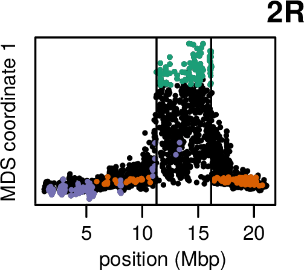

<!--  LOCAL PCA -->

# Tree *shape*: with local PCA

## Principal Components Analysis (PCA)

<!-- http://www.pnas.org/content/108/3/1088.full -->

----------------

## PCA describes the covariance matix

Genetic covariance between samples $i$ and $j$ is
the average over loci
and reference samples $x$, $y$ of:

::: {.center}

:::

... so summarizes average *patterns of relationships*
caused by *population structure*.

## Population structure

... is historical patterns of interbreeding, migration, and population sizes.

. . .

but: linked selection

**locally distorts** genealogical patterns.

**Question:** is there significant *shared* variation
in patterns of relatedness?

---------------

## `lostruct`

:::::::::::::: {.columns}
::: {.column width="50%"}

 * an R package
 * with templated Rmarkdown reports
 * and a script interface
 * [https://github.com/petrelharp/local_pca](https://github.com/petrelharp/local_pca)

:::
::: {.column width="50%"}

:::
::::::::::::::

## Data: African *D. melanogaster*

:::::::::::::: {.columns}
::: {.column width="50%"}

:::
::: {.column width="50%"}

* DPGP *(Langley et al 2012; Pool et al 2012; Lack et al 2015)*
* 380 mostly African samples -- WGS -- 9 Kb windows

:::
::::::::::::::

------------

* large, segregating inversions *(Corbett-Detig & Hartl 2012; Langley et al 2012)*

------------

* without less common inversion haplotypes: *linked selection?*

## Data: *Medicago truncatula* Hapmap (Tang et al 2014)

* 263 pan-Mediterranean samples -- WGS -- 100 Kb windows

##

## 

**Patterns are not driven by:**

* recombination rate variation
* polymorphism
* PC switching
* missingness

## {.center}

So, which is it?

. . .

? ? ?

----------------

