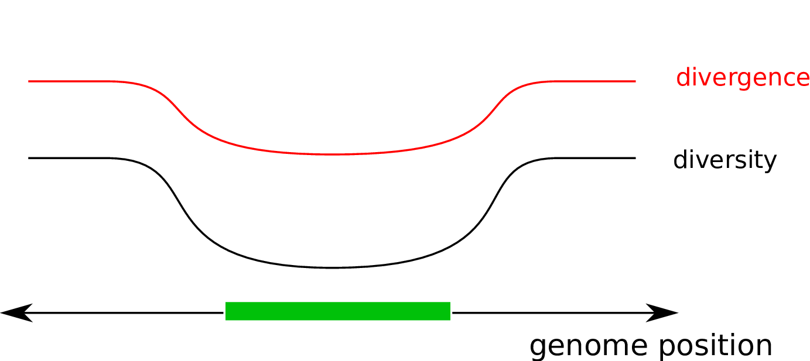
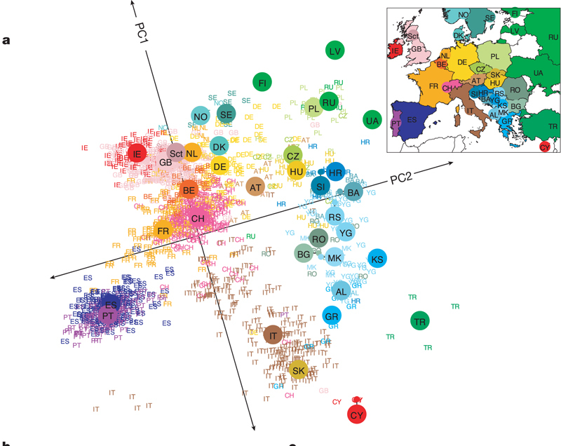
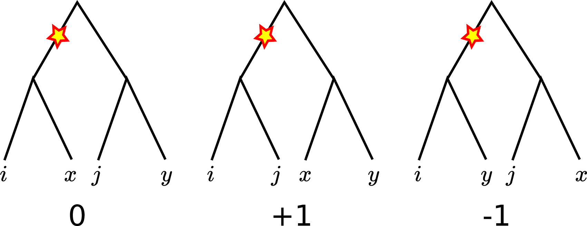
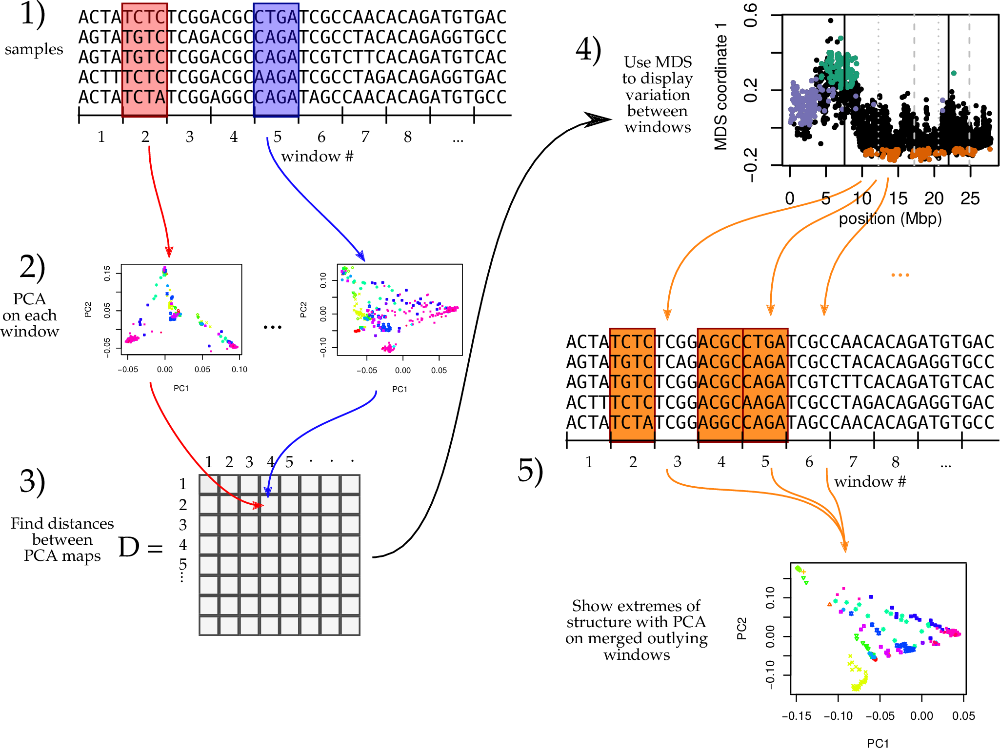
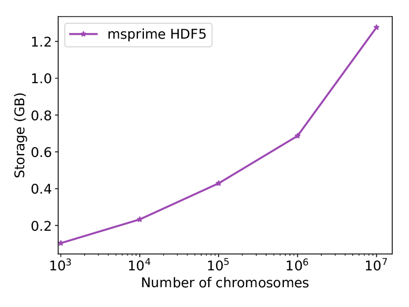
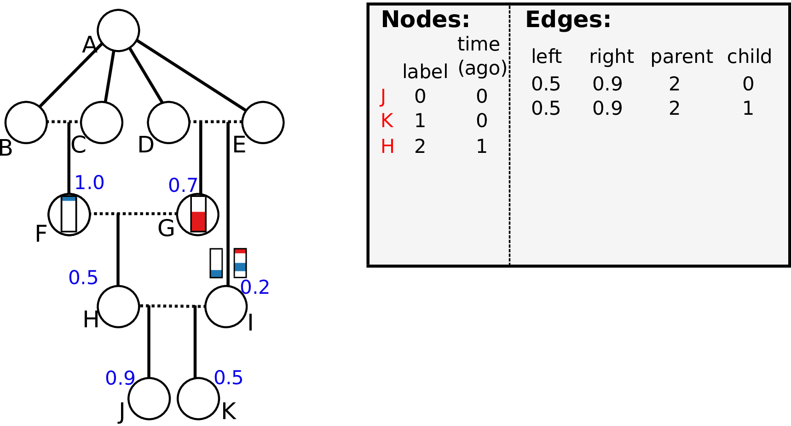

# Overview

1. *Theory:* a field guide to linked selection
2. *Practice:* some landscapes from the wild
3. *Simulation:* recent progress on a hard problem

--------------

*What's it all about?*

<!-- section THEORY -->

# Linked selection, in theory

--------------

linked selection

: The indirect effects of selection on nearby genomic locations,
  that are *linked* to the sites under selection by a lack of recombination.

Hitchhiking
-----------

Background selection
--------------------

Balanced polymorphism
---------------------

## *Drosophila melanogaster*

## *Homo sapiens*

## Diversity correlates with recombination rate

--------------------

--------------------

**A field guide**

*based on rough sketches*

0. Neutrality
-------------

1. A "hard" sweep
-----------------

2. A "soft" sweep
-----------------

3. Recent balancing selection
----------------------

4. Long-term balancing selection
----------------------

5. Adaptive introgression
-------------------------

6. Local adaptation
-------------------

[Bierne 2010](https://doi.org/10.1111%2fj.1558-5646.2010.01050.x)

7. Background selection
-----------------------

8. Recurrent sweeps
-------------------

9. Recurrent introgression
--------------------------

10. Recurrent local adaptation after a split
-------------------------------------------

11. Recurrent, transient balancing selection
--------------------------------------------

<!-- section PRACTICE -->

# Genomic landscapes

-------------------

-------------------

-------------------

The *Mimulus aurentiacus* species complex
-----------------------------------------

Tree *shape*: with local PCA
----------------------------

## Principal Components Analysis (PCA)

## Principal Components Analysis (PCA)

<!-- http://www.pnas.org/content/108/3/1088.full -->

## ... describes the covariance matix

Genetic covariance between samples $i$ and $j$ is
the average over loci
and reference samples $x$, $y$ of:

::: {.center}

:::

... so summarizes average *patterns of relationships*
caused by *population structure*.

## Population structure

... is historical patterns of interbreeding, migration, and population sizes.

. . .

but: {\Large linked selection}

**locally distorts** genealogical patterns.

**Question:** is there significant *shared* variation
in patterns of relatedness?

## Our method

## `lostruct`

:::::::::::::: {.columns}
::: {.column width="50%"}

 * an R package
 * with templated Rmarkdown reports
 * and a script interface
 * [https://github.com/petrelharp/local_pca](https://github.com/petrelharp/local_pca)

:::
::: {.column width="50%"}

:::
::::::::::::::

## Data: African *D. melanogaster*

* DPGP {\aside (Langley et al 2012; Pool et al 2012; Lack et al 2015)} \\
* 380 mostly African samples -- WGS -- 9 Kb windows
* large, segregating inversions {\aside (Corbett-Detig \& Hartl 2012; Langley et al 2012)}
* without less common inversion haplotypes: {\newthing linked selection?}

* 
* 
* 

## Data: *Medicago truncatula* Hapmap (Tang et al 2014)

* 263 pan-Mediterranean samples -- WGS -- 100 Kb windows

## 

**Patterns are not driven by:**

* recombination rate variation
* polymorphism
* PC switching
* missingness

## {class: "center";}

So, which is it?

. . .

? ? ?

----------------

<!-- section SIMULATION -->

# Simulation: not as easy as you might think

-----------------------------

To check predictions, we need simulations with:

- many loci under selection
- large populations with long genomes
- geographic population structure

for long enough to reach equilibrium ($\sim 10N$ generations).

. . .

For instance: $10^4$ individuals with $2 \times 10^8$ base pairs each for $10^5$ generations;
nonneutral mutations possible at $10^5$ loci.

---------------------------

**"many loci under selection"**

---------------------------

**S**election on **Li**nked **M**utations: *SLiM*

Messer 20XX

-------------------------------------

**"large populations with long genomes"**

-------------------------------------

(tree sequences)

<!-- 1. explain tree sequences and why they are so efficient (5min) -->
# The tree sequence

## History is a sequence of trees

For a set of sampled chromosomes,
at each position along the genome there is a genealogical tree
that says how they are related.

----------------------

A **tree sequence** describes this, er, sequence of trees.

. . .

*Observations:*

1. The *pedigree* (parental relationships) plus crossover locations
    would give us the tree sequence for *everyone, ever*.

2. Much less can fully describe the history relevant to a *sample* of genomes.

3. This information is equivalent to the Ancestral Recombination Graph (ARG).

-------------

[Kelleher, Etheridge, and McVean](http://journals.plos.org/ploscompbiol/article?id=10.1371/journal.pcbi.1004842) 
introduced the **tree sequence** data structure
for a fast coalescent simulator, [msprime](https://github.com/jeromekelleher/msprime).

- stores genealogical *and* variation data **very** compactly

- efficient algorithms available:

    * subsetting
    * calculation of allele frequencies in arbitrary cohorts
    * linkage disequilibrium
    * log-time haplotype matching

- tree-based sequence storage closely related to haplotype-matching compression

## Simulated file sizes

::: {.columns}
::::::: {.column width="50%"}

:::
::::::: {.column width="50%"}

- HapMap chr1 genetic map (250Mb)
- Gutenkunst et al out-of-Africa model (3 pops)
- mutation rate $2 \times 10^{-8}$ per gen
- at $n=10^7$ 

    * about 17 million variants
    * VCF size: 318 TiB (250,000$\times$ larger)

:::
:::::::

## Example: three samples; two trees; two variant sites

-----------------------

Storing a tree sequence in
the four tables - *nodes*, *edges*, *sites*, and *mutations* -
is *succinct* (no redundancy).

. . .

These are stored efficiently (hdf5) on disk
with a bit more information (e.g., metadata).

## Nodes and edges

Edges 

:   Who inherits from who; only *necessary* for coalescent events.

    Records: interval (left, right); parent node; child node.

Nodes 

:   The ancestors those happen in.

    Records: time ago (of birth); ID (implicit).

-------------------

-------------------

-------------------

-------------------

-------------------

-------------------

-------------------

## Sites and mutations

Mutations

:   When state changes along the tree.

    Records: site it occured at; node it occurred in; derived state.

Sites 

:   Where mutations fall on the genome.

    Records: genomic position; ancestral (root) state; ID (implicit).

------------------

------------------

------------------

------------------

------------------

<!-- 4. explain application to fwds sim recording (5min) -->
# Forwards-time tree sequence recording

## The main idea

If we *record the tree sequence*
that relates everyone to everyone else,

after the simulation is over we can put neutral mutations down on the trees.

. . .

Since neutral mutations don't affect demography,

this is *equivalent* to having kept track of them throughout.

------------

This means recording the entire genetic history of **everyone** in the population, **ever**.

.  . .

It is *not* clear this is a good idea.

## Tree recording strategy

Every time an individual is born, we must:

::: incremental

1. add each gamete to the Node Table,
2. add entries to the Edge Table
    recording which parent each gamete inherited each bit of genome from, and
3. add any new selected mutations to the Mutation Table 
    and (if necessary) their locations to the Site Table.

:::

. . .

::: {.columns}
:::::: {.column width=15%}

{width="100%"}

:::
:::::: {.column width=5%}

:::
:::::: {.column width=75%}

This produces **waaaaay** too much data.

:::
::::::

-------------------

We won't end up needing the *entire* history
of *everyone ever*,

. . .

but we won't know *what* we'll need until later.

. . .

How do we get rid of the extra stuff?

## Simplification

*Question:* given a tree sequence
containing the history of many individuals,
how do we *simplify* it to only the history
of a subset?

-----------

Concretely, given an input tree sequence
and a subset of its nodes we call the *samples*,
we want a new tree sequence for which:

1. All marginal trees match the corresponding subtree 
    in the input tree sequence.

2. Every non-sample node in marginal trees has at least two children.

3. All nodes and edges are ancestral to at least one sample.

4. No adjacent redundant edges 
    (e.g., $(\ell, x, p, c) + (x, r, p, c) \rightarrow (\ell, r, p, c)$).

-----------

*Answer:* to simplify a tree sequence
to the history of the *samples*:

1. Paint each *sampled* chromosome a distinct color.

2. Moving back up the tree sequence,
    copy colors of each chromosome to the parental chromosomes
    they inherited from.

3. If two colors go in the same spot (*coalescence*),
    replace with a new color (unique to that ancestor).
    Output a node for the ancestor and an edge for the coalescence.

4. Once all colors have coalesced in a given segment,
    stop propagating it.

## An example: simplify these to J and K

{ width="100%" }

-------------------

{ width="100%" }

-------------------

{ width="100%" }

-------------------

{ width="100%" }

-------------------

{ width="100%" }

-------------------

{ width="100%" }

-------------------

{ width="100%" }

-------------------

{ width="100%" }

-------------------

{ width="100%" }

-------------------

{ width="100%" }

-------------------

{ width="100%" }

-------------------

{ width="100%" }

-------------------

{ width="100%" }

-------------------

{ width="100%" }

-------------------

{ width="100%" }

-------------------

{ width="100%" }

-------------------

{ width="100%" }

## Wright-Fisher, N=10: before simplification

## Wright-Fisher, N=10: before simplification

## ... and after simplification

## *Revised* tree recording strategy

Every time an individual is born, we must:

1. add each gamete to the Node Table,
2. add entries to the Edge Table
    recording which parent each gamete inherited each bit of genome from
3. add any new mutations to the Mutation Table 
    and (if necessary) their locations to the Site Table.

... and,

4. Every so often, *simplify* the tables so far,
    retaining the history of the current generation.

<!-- 5. display impressive speedups 2min) -->

## {.slide: class="center"}

**Implementation and results**

## Benchmark implementation

- Recording, simplifying, and output of tables: 
    `C` code in `msprime`.

- Simulation: [`fwdpp`](https://github.com/molpopgen/fwdpp), by Kevin Thornton (in `C++`) ([code](https://github.com/molpopgen/fwdpy11_arg_example))

- Glue: [`pybind11`](https://github.com/pybind/pybind11/) and [`numpy`](http://www.numpy.org/)

- Machine: Ubuntu / 2x 2.6 GHz Intel E5-2650 CPU

. . .

*Other implementations:* 

- [pure `python`](https://github.com/ashander/ftprime), interfacing with [`simuPOP`](https://github.com/BoPeng/simuPOP)
- [cython](https://github.com/molpopgen/tutorials/blob/cython_cpp_tutorial/notebooks/wfcython.ipynb)

## Simulation parameters

1. Wright-Fisher population of size $N$
2. simulated for $10N$ genreations
3. neutral mutation rate $\mu$ equal to recombination rate $r$ per gamete
4. many, weakly deleterious mutations: rate $\mu/100$ with
    $s$ exponentially distributed with mean $2.5/N$.

. . .

*Note:*
if we recorded tree sequences ("pedigree recording")
then the neutral mutation rate was *zero*
but neutral mutations were added *afterwards*.

--------------------------

{ width=80% }

--------------------------

{ width=80% }

# Back to the main program

-------------------------------------

**"geographic population structure"**

-------------------------------------

(SLiM v3)

nonWF

Results of simulation
---------------------

Summary
-------

We've got the tools to understand
what it is that we don't know.

Thanks!
-------

- Madeline Chase
- Sean Stankowski
- Matt Streisfeld 
- Andy Kern (UO)

Jerome, Jaime, and Kevin: 

[{width="30%"}](http://jeromekelleher.net/pages/about.html), [{width="30%"}](http://www.ashander.info/) [{width="30%"}](https://github.com/molpopgen).

Funding: NSF ABI, Sloan (PR); Wellcome Trust (JK); NIH (KRT); USF&WS (JDA).

Slides with [reveal.js](http://hakim.se) and [pandoc](https://pandoc.org/).

